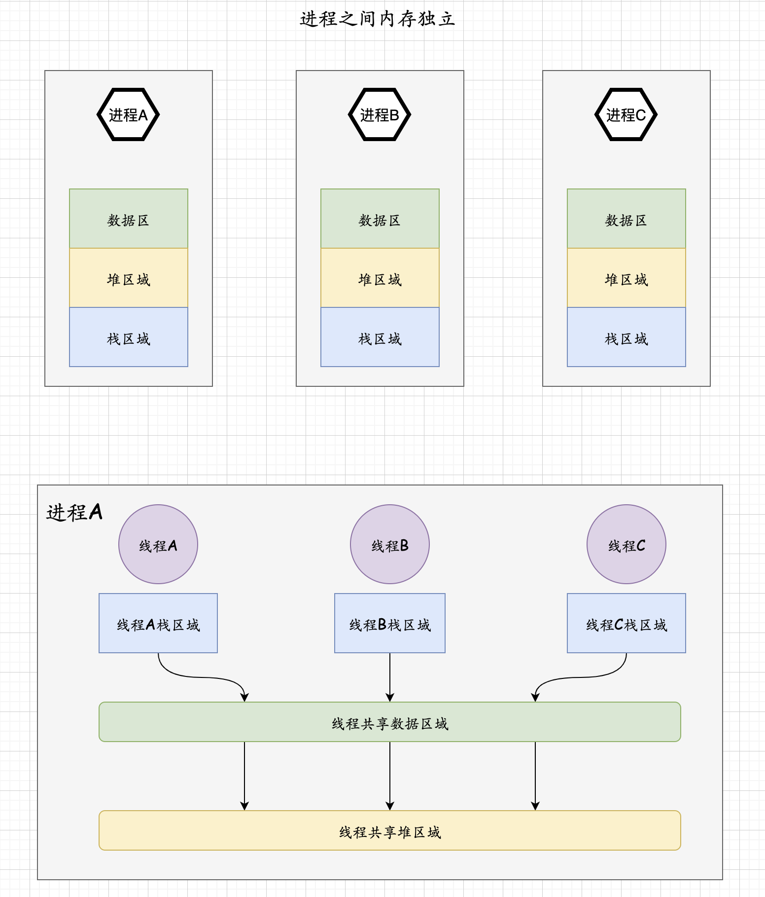

### 多进程模式的缺点

创建进程的过程会带来一定的开销

为了完成进程间的数据交换，需要特殊的IPC技术

多个进程间会发生频繁的上下文切换

### 线程的优势

线程的创建和上下文切换比进程的创建和上下文切换更快

线程之间的数据交换，不需要特殊技术

### 进程内部的概览

进程的内存空间由

1. 保存全局变量的数据区

2. 向malloc等函数的动态分配提供空间的堆 heap

3. 函数运行时候使用的栈 stack构成

### 进程和线程区别

进程，操作系统构成的单独执行流单位

线程，进程构成的单独执行流单位

### POSIX标准

POSIX, portable operating system interface for computer environment

适用于计算机环境的可移植性操作系统接口

### 临界区 critical section

多个线程同时执行临界区代码时候，可能会产生问题

根据临界区是否会引发问题，函数可以分为两类：

线程安全函数 thread-safe function
 
非线程安全函数 thread-unsafe function

操作系统通常会提供， 函数对应的线程安全的函数，以 _r后缀表示

### 互斥量

mutual exclusion 互斥量

死锁 dead-lock

